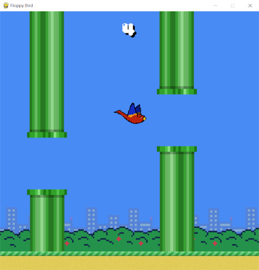

A Flappy Bird knockoff made in Python using Pygame.

## How to play

Use the space bar or the up arrow to navigate floppy bird through an infinite level of randomly generated pipes.

If you touch a pipe, you lose! And you will be sent back to the menu.

Floppy bird keeps track of your high score, so you will remember to play better next time!

## Images

The title screen of floppy bird

Gameplay of floppy bird

The game over screen, a new high score was set!

## Thanks

Big thanks to my friend E, who designed the floppy bird sprites

Background was created by me

## Fonts

+ Title font - Hardpixel
+ Score font - 04b
+ Death/Info font - FFF Forward
